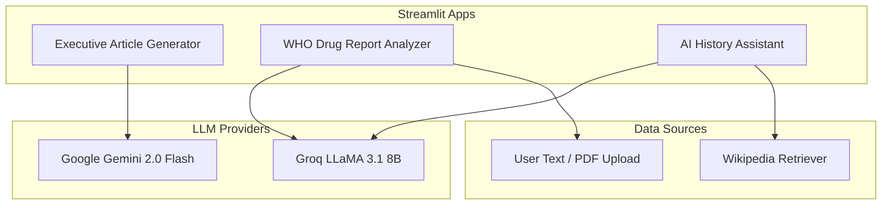

# AgentFlow AI


**Generative AI applications for enterprise content, healthcare data, and knowledge retrieval.**

AgentFlow AI is a collection of three standalone Streamlit + LangChain demo applications built as Generative AI coursework (`GEN_AI_MH`), evolving toward a full multi-agent enterprise intelligence platform.

> **Note:** This repository currently contains prototype applications. There is no database, Docker setup, or unified backend yet.

---

## Applications

| App | Folder | Model | Purpose |
|-----|--------|-------|---------|
| **Executive Article Generator** | `GEN_AI_Assignment_01/` | Google Gemini 2.0 Flash | Generate strategic corporate articles with structured sections |
| **WHO Drug Report Analyzer** | `GEN_AI_Assignment_02/` | Groq LLaMA 3.1 8B | Extract structured drug information from PDF/TXT reports |
| **AI History Assistant** | `GEN_AI_Assignment_03/` | Groq + Wikipedia RAG | Streaming history Q&A with chat memory and summarisation |

---

## Architecture



---

## Tech Stack

- **Python 3.10+**
- **Streamlit** — web UI for all three applications
- **LangChain** — prompt chains, output parsing, RAG pipelines
  - `langchain` / `langchain-core`
  - `langchain-google-genai` (Assignment 01)
  - `langchain-groq` (Assignments 02 & 03)
  - `langchain-community` (Wikipedia retriever)
- **python-dotenv** — environment variable management
- **pdfplumber** — PDF text extraction (Assignment 02)

---

## Prerequisites

- Python 3.10 or higher
- API keys for the LLM providers you plan to use:

| Key | Required For | How to Obtain |
|-----|--------------|---------------|
| `GROQ_API_KEY` | Assignments 02 & 03 | [Groq Console](https://console.groq.com/) |
| Google Gemini API key | Assignment 01 | [Google AI Studio](https://aistudio.google.com/) — entered via sidebar at runtime |

---

## Installation

```bash
git clone https://github.com/MuhammadHassaanmh162/agentflow-ai.git
cd agentflow-ai
pip install -r requirements.txt
```

### Environment Setup

Copy the example environment file and add your Groq API key:

```bash
cp .env.example .env
```

Edit `.env` and set your key:

```
GROQ_API_KEY=your_groq_api_key_here
```

> Assignment 01 uses a Google Gemini API key entered directly in the Streamlit sidebar — it is never stored on disk.

---

## Running the Apps

### Assignment 01 — Executive Article Generator

```bash
streamlit run GEN_AI_Assignment_01/Assignment_01_GEN_AI_MH.py
```

1. Enter your Gemini API key in the sidebar
2. Type an article topic
3. Choose a tone (Formal / Concise / Strategic)
4. Click **Generate**

**Features:** streaming output, structured sections (Executive Summary, Background, Insights, Implications, Recommendations, Conclusion), `.txt` download.

---

### Assignment 02 — WHO Drug Report Analyzer

```bash
streamlit run GEN_AI_Assignment_02/Assignment_02_GEN_AI_MH.py
```

Requires `.env` with a valid `GROQ_API_KEY`.

**Features:**
- Upload `.txt` or `.pdf` drug reports, or paste text directly
- Structured JSON extraction: drug name, active ingredients, indications, dosage, side effects, contraindications
- AI-generated narrative summary for healthcare professionals
- Download results as JSON

---

### Assignment 03 — AI History Assistant

```bash
streamlit run GEN_AI_Assignment_03/Assignment_03_GEN_AI_MH.py
```

Requires `.env` with a valid `GROQ_API_KEY`.

**Features:**
- Wikipedia RAG — retrieves relevant passages before answering
- Streaming chat responses
- Conversation history with automatic summarisation after 10+ messages
- Manual summarise and clear history controls

**CLI variant** (no Streamlit UI):

```bash
python GEN_AI_Assignment_03/_history_assistant.py
```

---

## Project Structure

```
agentflow-ai/
├── GEN_AI_Assignment_01/
│   └── Assignment_01_GEN_AI_MH.py      # Executive Article Generator
├── GEN_AI_Assignment_02/
│   └── Assignment_02_GEN_AI_MH.py      # WHO Drug Report Analyzer
├── GEN_AI_Assignment_03/
│   ├── Assignment_03_GEN_AI_MH.py      # AI History Assistant (Streamlit)
│   └── _history_assistant.py           # AI History Assistant (CLI)
├── requirements.txt
├── .env.example
└── README.md
```

---

## Roadmap

AgentFlow AI is designed to grow into a full enterprise intelligence platform:

- [ ] Unified multi-agent orchestration layer
- [ ] Shared agent framework and API gateway
- [ ] Enterprise connectors (CRM, ERP, internal document stores)
- [ ] Docker deployment and CI/CD pipeline
- [ ] Persistent conversation and data storage

---

## Author

**Muhammad Hassaan** (`GEN_AI_MH`)

---

## License

This project is licensed under the [MIT License](LICENSE).

---

## Repository Rename

This project is recommended to be published under the shorter name **`agentflow-ai`**.

To rename on GitHub:

1. Go to **Settings → Repository name** and set it to `agentflow-ai`
2. Update your local remote:

```bash
git remote set-url origin https://github.com/MuhammadHassaanmh162/agentflow-ai.git
```
